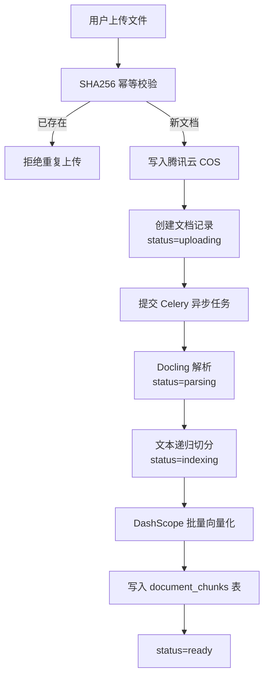
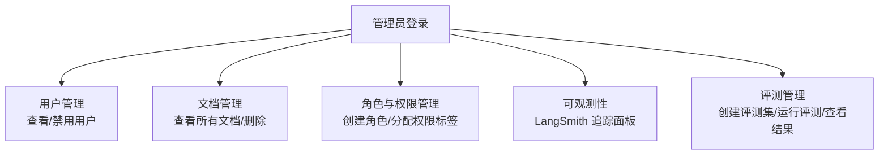

## 一、项目介绍
这是一套以 **AI 应用开发实战 + Python 后端工程化** 为核心的项目教程，基于 FastAPI + LangChain + LangGraph + React 开发企业级 **RAG 智能知识库系统**，带大家掌握新时代程序员必知必会的 RAG 检索增强生成、Agentic 工作流编排、向量检索等前沿技术，大幅提升求职竞争力！

### 4 大核心能力
1）智能文档入库：用户上传 PDF / DOCX / Markdown / HTML 文档，系统自动完成解析、切分、向量化全过程，支持异步处理和状态实时反馈。

2）知识库问答：基于 LangGraph 编排的 Agentic RAG 工作流，融合向量检索与全文检索，逐 token 流式输出答案，每条回答附带来源引用，让用户知道答案依据。

3）多轮对话与会话管理：支持上下文连续追问，AI 能理解对话历史进行多轮推理；多会话隔离，用户可以针对不同主题创建独立对话。

4）企业级工程能力：认证鉴权、文档级权限过滤、语义缓存、接口限流、全链路可观测、自动化评测、MCP Server 集成，一个项目覆盖生产环境所需的全部能力。

当你学会这个项目后，你不仅能开发 RAG 知识库，更能灵活开发各种 AI 应用：AI 客服系统、智能文档助手、企业内部搜索引擎、AI 法律 / 医疗 / 金融领域问答系统，尽情发挥自己的想象力吧！

### 为什么做这个项目？
1）行业刚需：RAG 是当前大模型落地最成熟的范式，几乎每家公司的 AI 项目都需要知识库能力。掌握 RAG 开发就是掌握 AI 应用开发的核心技能。

2）找工作好用：随着 AI 发展，企业对能落地 AI 应用的开发者需求激增。RAG 项目技术含量高、知识面广，面试时一个项目能聊出十几个技术深度问题。

3）技术值得学：此类项目不仅涉及 AI 工程（向量检索、工作流编排、Prompt Engineering），还需要扎实的后端功底（异步编程、缓存设计、权限模型、可观测性），是综合能力的最佳练兵场。

## 二、项目优势
### 项目收获
本项目紧跟 AI 时代、选题硬核、**对标企业真实需求**、技术丰富。区别于增删改查的普通项目，教程会带你实战大量前沿技术和企业应用场景，掌握层层递进的系统设计、项目扩展和优化方案，帮你成为 AI 时代企业的香饽饽，给你的简历和求职大幅增加竞争力！

Python + AI 全栈项目，技术丰富，玩透 LangChain + LangGraph：

业务场景真实，实践大量企业解决方案：

从这个项目中你可以学到：

+ 如何基于 LangChain + LangGraph 构建生产级 RAG 应用？
+ 如何实现 Agentic RAG 工作流，让 AI 动态决策检索策略？
+ 如何设计混合检索架构（向量 + 全文 + RRF 融合 + Reranker 精排）？
+ 如何实现 Query 优化（改写 / HyDE / Multi-Query），提升检索召回率？
+ 如何用 SSE 流式输出实现打字机效果的实时问答？
+ 如何基于 JWT + RBAC 实现认证权限，并在检索层做文档级安全过滤？
+ 如何利用 Redis 实现语义缓存和滑动窗口限流？
+ 如何用 Celery 处理耗时的文档入库异步任务？
+ 如何集成 LangSmith 实现全链路可观测，定位每次问答的瓶颈？
+ 如何基于 RAGAS 框架做自动化评测和 Bad Case 归因分析？
+ 如何通过 MCP 协议将知识库能力暴露给 Cursor、Claude Desktop 等外部 Agent？
+ 如何基于宝塔面板 + Nginx + Docker Compose 完成生产部署？

此外，还能学会很多 AI 工程化、系统架构设计、技术方案对比的方法，提升排查问题、自主解决 Bug 的能力。教程还提供了大量的项目扩展点，有能力的同学可以进一步拉开和别人的区分度，无限进步！

## 三、业务流程
### 核心业务流程
从用户注册登录 => 上传文档入库 => 知识库问答 => 多轮对话

### 文档入库流程

### RAG 问答流程

### 管理员流程
管理员可以管理用户、文档、角色权限，以及查看系统可观测性数据：

## 四、功能模块

### 文档管理模块
+ 文档上传（PDF / DOCX / Markdown / HTML）
+ SHA256 幂等校验（防止重复上传）
+ 腾讯云 COS 对象存储
+ 文档状态流转（uploading → parsing → indexing → ready / failed）
+ ⭐️ Celery 异步任务处理
+ 文档列表查询与删除
+ 文档切片预览

### 检索模块
+ ⭐️ 向量检索（pgvector 余弦距离）
+ ⭐️ 中文全文检索（PostgreSQL + zhparser）
+ ⭐️ RRF 融合排序
+ ⭐️ Reranker 交叉编码精排
+ 文档级权限过滤

### 问答模块
+ ⭐️ LangGraph RAG 工作流
+ ⭐️ Query 路由（简单问题 / 需要检索）
+ ⭐️ Query 改写
+ ⭐️ HyDE 假设文档生成
+ ⭐️ Multi-Query 多角度查询
+ ⭐️ Agentic 多轮检索决策
+ SSE 流式输出
+ 答案引用校验与来源标注
+ 多轮对话上下文保持

### 会话管理模块
+ 创建 / 删除会话
+ 会话列表查询
+ 消息历史分页查询
+ 多会话隔离

### 认证与权限模块
+ JWT 无状态认证
+ RBAC 角色权限模型
+ ⭐️ 基于权限标签的安全检索
+ 接口级权限校验

### 缓存与限流模块
+ ⭐️ Redis 语义缓存（基于 RedisVL）
+ ⭐️ 滑动窗口限流
+ 增量索引（文档更新时自动失效相关缓存）

### 可观测性模块
+ ⭐️ LangSmith 全链路追踪
+ 每次问答的节点级输入/输出/耗时追溯

### 评测模块
+ ⭐️ RAGAS 自动化评测
+ 评测数据集管理
+ 批量评测运行
+ Bad Case 归因分析

### MCP Server 模块
+ ⭐️ 通过 MCP 协议暴露知识库能力
+ 支持 Cursor、Claude Desktop 等外部 Agent 调用
+ 文档检索 + 知识库问答两种 Tool

### 部署模块
+ Docker Compose 编排基础设施
+ systemd 管理后端服务
+ Nginx 反向代理 + 前端静态托管
+ 宝塔面板辅助运维

## 五、技术选型

### 后端
核心：

+ Python 3.12+
+ FastAPI 框架（异步 Web 框架）
+ SQLAlchemy 2.0 ORM + Alembic 数据迁移
+ Pydantic 数据校验与序列化
+ uv 包管理工具

AI 技术：

+ ⭐️ LangChain 框架（文档处理、Embedding、检索链路）
+ ⭐️ LangGraph 工作流引擎（RAG 状态机编排）
+ ⭐️ DashScope text-embedding-v3 向量化
+ ⭐️ DashScope Reranker 精排
+ ⭐️ 通义千问 Chat 大模型
+ ⭐️ SSE 流式输出
+ ⭐️ Agentic RAG（多轮检索决策）
+ ⭐️ MCP 协议集成

数据存储：

+ PostgreSQL 数据库
+ ⭐️ pgvector 向量检索扩展
+ ⭐️ zhparser 中文全文检索扩展
+ ⭐️ Redis（语义缓存 + 限流 + Celery broker）
+ 腾讯云 COS 对象存储

异步任务：

+ ⭐️ Celery 分布式任务队列
+ Redis 作为消息 Broker 和结果 Backend

可观测性与评测：

+ ⭐️ LangSmith 全链路追踪
+ ⭐️ RAGAS 评测框架

### 前端
核心：

+ React 18 + TypeScript
+ Ant Design 组件库
+ TanStack Query 数据请求
+ React Router 路由
+ Markdown 渲染 + 代码高亮

工程化：

+ Vite 构建工具
+ OpenAPI TypeScript Codegen（自动生成 API 类型）
+ ESLint 代码校验

### 部署与运维
+ Docker + Docker Compose
+ Nginx 反向代理
+ systemd 服务管理
+ 宝塔面板

### 开发工具
+ ⭐️ Cursor AI 编辑器

## 六、架构设计
从客户端发送请求开始，自上而下经过一系列处理，最终得到响应结果。架构图如下：

## 七、准备工作
### 新建代码仓库
利用 GitHub 搭建开源代码仓库，点 star 的都是精神股东

代码仓库：[https://github.com/aixunlian/rag-knowledge-base](https://github.com/aixunlian/rag-knowledge-base)

### AI 学习资源
#### 1、AI 面试题
建议大家在学习 AI 项目的过程中，持续阅读 AI 大模型相关的面试题，巩固知识点。这块鱼皮已经帮大家拿捏了，我们的程序员面试刷题神器面试鸭搞了个 [AI 大模型面试题库](https://www.mianshiya.com/bank/1906189461556076546)，建议没事就阅读一些题目来学习学习。

#### 2、开源 AI 知识库
由于 AI 技术日新月异，建议大家平时多关注 AI 相关的资讯动态，比如 [鱼皮开源的 AI 知识库](https://github.com/liyupi/ai-guide)，汇总了热门的 AI 大模型和工具，比如 Deepseek 使用指南、提示词技巧分享、知识干货、应用场景、AI 变现、行业资讯、教程资源等一系列内容，帮助你快速掌握 AI 技术，走在时代前沿。

#### 3、免费 AI 交流
编程导航提供了 [免费的 AI 学习交流社区](https://ai.codefather.cn/)，大家可以畅所欲言！

## 八、学习大纲
为了帮大家循序渐进地学习，教程将项目设计为三个阶段，可以根据自己的时间和水平按需学习。

### 第一阶段 - RAG 核心链路
第 1 期：项目总览

+ 项目介绍
+ 项目优势
+ 业务流程
+ 功能模块
+ 技术选型
+ 架构设计
+ 准备工作（前置知识 + AI 学习资源）
+ 学习大纲

第 2 期：项目初始化

+ 后端项目初始化（FastAPI + SQLAlchemy + Alembic + 配置管理 + 日志 + COS）
+ 前端项目初始化（React + Ant Design + TanStack Query + 路由）
+ 前后端联调

第 3 期：文档向量化

+ 需求分析与方案设计
+ 文档上传与 COS 存储
+ Docling 文档解析
+ RecursiveCharacterTextSplitter 文本切分
+ DashScope Embedding 向量化
+ 异步处理与状态流转
+ 前端文档管理页面

第 4 期：知识库问答

+ LangChain + LangGraph 入门
+ RAG 工作流设计（检索→生成）
+ 向量检索实现
+ SSE 流式输出
+ 答案引用与来源标注
+ 多轮对话上下文
+ 前端对话页面

### 第二阶段 - 检索与工作流进阶
第 5 期：Query 优化

+ Query 路由
+ Query 改写
+ HyDE 假设文档生成
+ Multi-Query 多角度查询

第 6 期：全文检索、混合检索与 RRF

+ PostgreSQL + zhparser 全文检索
+ 向量检索 + 全文检索双通道
+ RRF 倒数排名融合

第 7 期：Agentic RAG

+ Agent 多轮检索决策
+ 信息充分性判断
+ 动态检索策略调整

第 8 期：检索链路优化与答案可信度

+ Reranker 交叉编码精排
+ 答案引用校验
+ 可信度评估

### 第三阶段 - 企业级能力建设
第 9 期：可观测性

+ LangSmith 集成
+ 全链路追踪配置
+ 节点级性能分析

第 10 期：评测与 Bad Case 分析

+ RAGAS 评测框架集成
+ 评测数据集管理
+ 批量评测运行
+ Bad Case 归因与改进

第 11 期：认证、权限与安全检索

+ JWT 无状态认证
+ RBAC 角色权限模型
+ 基于权限标签的文档级安全检索

第 12 期：缓存、限流、异步任务与增量索引

+ Redis 语义缓存（RedisVL）
+ 滑动窗口限流
+ Celery 异步任务
+ 增量索引与缓存失效

第 13 期：MCP Server 集成

+ MCP 协议介绍
+ 知识库 MCP Server 实现
+ Cursor / Claude Desktop 接入验证

第 14 期：部署上线

+ Docker Compose 编排 PostgreSQL + Redis
+ systemd 管理后端 + Celery Worker
+ Nginx 反向代理与前端部署
+ 宝塔面板配置

